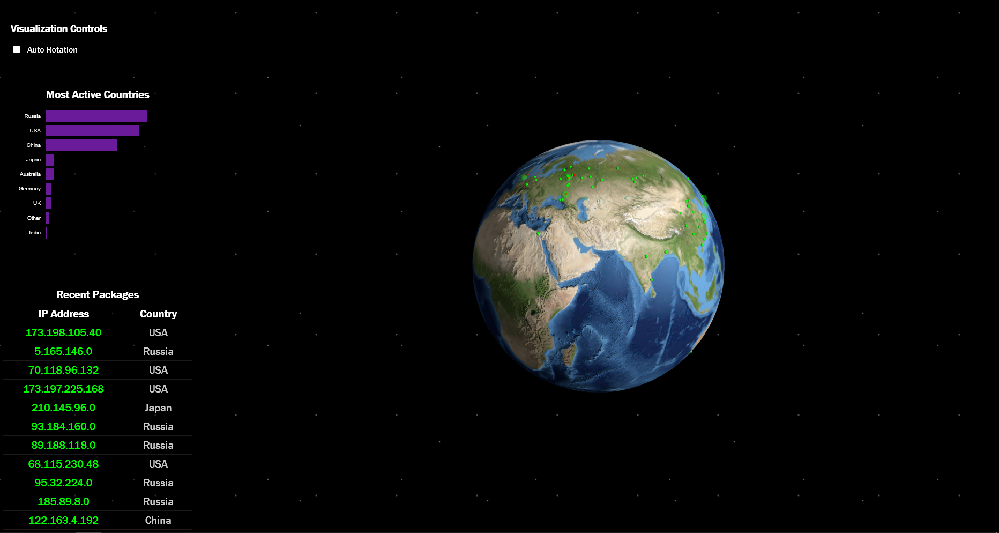

# DWV Assignment II

Interactive IP Packet Visualization System
=====================================

## Table of Contents
- [Overview](#overview)
- [Key Features](#key-features)
- [Technical Stack](#technical-stack)
- [Getting Started](#getting-started)
- [Deployment](#deployment)
- [Author](#author)

## Overview
[](imgs/screenshot.png)

IP Packet Globe Visualization System is an interactive data visualization project built for the DWV course. The application creates an immersive globe visualization of IP packets while providing detailed statistical analysis and insights.

## Key Features
- 🌍 Interactive 3D globe visualization
- 📊 Real-time packet statistics
- 📈 Dynamic bar plot representations
- 🔄 Data analysis capabilities

## Technical Stack
### Frontend
* **THREE.js**: Core 3D globe visualization engine
* **D3.js**: Statistical visualization components
* **HTML/CSS**: Responsive UI implementation

### Backend
* **Flask**: REST API framework
* **API Endpoints**:
  * `/packets`: Packet data streaming
  * `/packet`: Packet delivery

### Data Analysis
* **Pandas**: Dataset processing and statistical analysis
* **Plotly**: Additional visualization utilities

## Getting Started
Prerequisites:
```markdown
- Docker installed on your system
- Minimum 4GB RAM recommended
- Modern web browser supporting WebGL
```

Installation Steps:
```bash
# Clone the repository
git clone https://github.com/LowIQCoder/DWV_A2.git DWV_A2_mrbrtg

# Navigate to project directory
cd DWV_A2_mrbrtg

# Build and start containers
docker-compose up --build
```

## Deployment
Access the application at [localhost:8080](http://localhost:8080)

## Author
👤 **Marsel Berheev**
- m.berheev@innopolis.university

Development Time: ~10 hours
